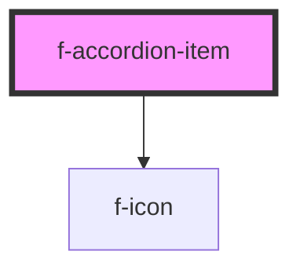

# f-accordion-item

<!-- Auto Generated Below -->

## Properties

| Property      | Attribute      | Description                          | Type      | Default     |
| ------------- | -------------- | ------------------------------------ | --------- | ----------- |
| `contentUuid` | `content-uuid` | UUID for the accordion content       | `string`  | `undefined` |
| `isExpanded`  | `is-expanded`  | is the item expanded                 | `boolean` | `false`     |
| `text`        | `text`         | the title of the accordion item      | `string`  | `undefined` |
| `uuid`        | `uuid`         | UUID for the accordion toggle button | `string`  | `undefined` |

## CSS Custom Properties

| Name                            | Description                        |
| ------------------------------- | ---------------------------------- |
| `--f-accordion-content-padding` | internal padding for content slots |

## Dependencies

### Depends on

- [f-icon](../f-icon)

### Graph

----------------------------------------------

*Built with [StencilJS](https://stenciljs.com/)*
