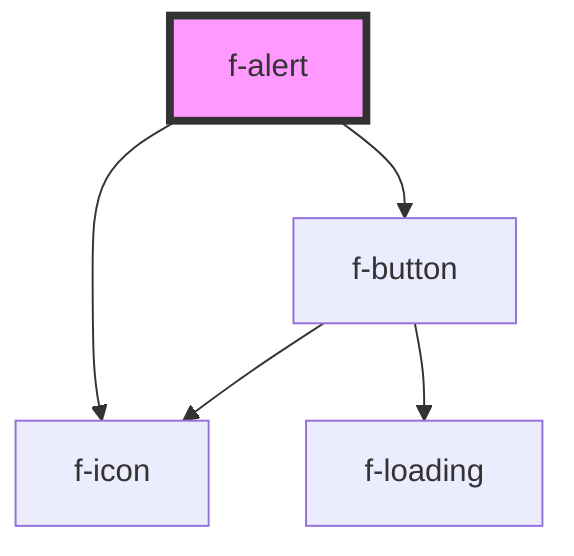

# f-alert

A way of informing the user of important changes in a prominent way.

<!-- Auto Generated Below -->

## Properties

| Property        | Attribute        | Description           | Type                                                     | Default     |
| --------------- | ---------------- | --------------------- | -------------------------------------------------------- | ----------- |
| `closeUuid`     | `close-uuid`     | uuid of close button  | `string`                                                 | `undefined` |
| `inContainer`   | `in-container`   | is alert in container | `boolean`                                                | `false`     |
| `isDismissable` | `is-dismissable` | is alert dismissable  | `boolean`                                                | `false`     |
| `variant`       | `variant`        | variant of alert      | `"error" \| "info" \| "naked" \| "success" \| "warning"` | `'info'`    |

## Events

| Event     | Description                                                 | Type               |
| --------- | ----------------------------------------------------------- | ------------------ |
| `dismiss` | emits {dismissed: true} object when close button is clicked | `CustomEvent<any>` |

## CSS Custom Properties

| Name                  | Description       |
| --------------------- | ----------------- |
| `--f-alert-display`   | display type      |
| `--f-alert-min-width` | minwidth of alert |
| `--f-alert-width`     | specific width    |

## Dependencies

### Depends on

- [f-icon](../f-icon)
- [f-button](../f-button)

### Graph

----------------------------------------------

*Built with [StencilJS](https://stenciljs.com/)*
