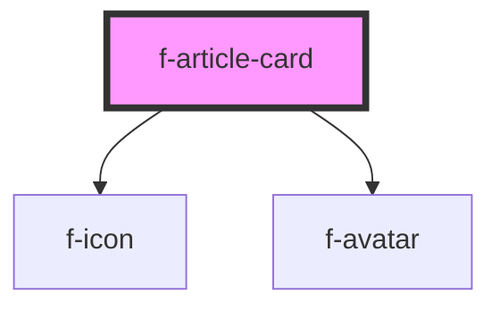

# f-article-card

A container for content representing a single entity. e.g. a contact, article, or task.

<!-- Auto Generated Below -->

## Properties

| Property         | Attribute         | Description                                  | Type                             | Default     |
| ---------------- | ----------------- | -------------------------------------------- | -------------------------------- | ----------- |
| `articleIcon`    | --                | icon for article if no text or image present | `IIconConfig`                    | `undefined` |
| `callToAction`   | --                | text and url for the call to action link     | `{ text: string; url: string; }` | `undefined` |
| `glowBackground` | `glow-background` | string of full path of background glow image | `string`                         | `undefined` |
| `headerText`     | `header-text`     | text for header of article card              | `string`                         | `undefined` |
| `imageAltText`   | `image-alt-text`  | altText for avatar image                     | `string`                         | `undefined` |
| `imageText`      | `image-text`      | text if no avatar is present                 | `string`                         | `undefined` |
| `imageUrl`       | `image-url`       | image url for avatar                         | `string`                         | `undefined` |

## Dependencies

### Depends on

- [f-icon](../f-icon)
- [f-avatar](../f-avatar)

### Graph

----------------------------------------------

*Built with [StencilJS](https://stenciljs.com/)*
