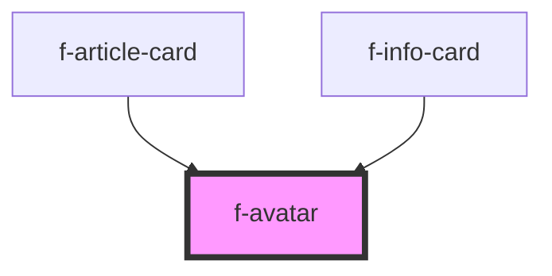

# f-avatar

A graphical representation of a user: usually a photo, illustration, or initial.

<!-- Auto Generated Below -->

## Properties

| Property       | Attribute        | Description                  | Type     | Default     |
| -------------- | ---------------- | ---------------------------- | -------- | ----------- |
| `imageAltText` | `image-alt-text` | altText for avatar image     | `string` | `undefined` |
| `imageText`    | `image-text`     | text if no avatar is present | `string` | `undefined` |
| `imageUrl`     | `image-url`      | image url for avatar         | `string` | `undefined` |

## Dependencies

### Used by

 - [f-article-card](../f-article-card)
 - [f-info-card](../f-info-card)

### Graph

----------------------------------------------

*Built with [StencilJS](https://stenciljs.com/)*
