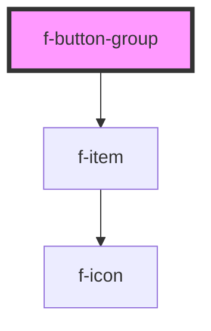

# f-button-group

A wrapper for multiple, related buttons.

<!-- Auto Generated Below -->

## Properties

| Property   | Attribute  | Description                       | Type                   | Default     |
| ---------- | ---------- | --------------------------------- | ---------------------- | ----------- |
| `disabled` | `disabled` | are all buttons in group disabled | `boolean`              | `false`     |
| `items`    | --         | Array of items                    | `IItemModel[]`         | `undefined` |
| `size`     | `size`     | size of button group              | `"default" \| "small"` | `'default'` |

## Events

| Event                     | Description                          | Type               |
| ------------------------- | ------------------------------------ | ------------------ |
| `buttonGroupItemSelected` | emits button in group being selected | `CustomEvent<any>` |

## CSS Custom Properties

| Name                                  | Description                                |
| ------------------------------------- | ------------------------------------------ |
| `--f-button-group-item-justification` | item justification                         |
| `--f-button-group-item-min-width`     | min-width of each item of the button-group |

## Dependencies

### Depends on

- [f-item](../f-item)

### Graph

----------------------------------------------

*Built with [StencilJS](https://stenciljs.com/)*
