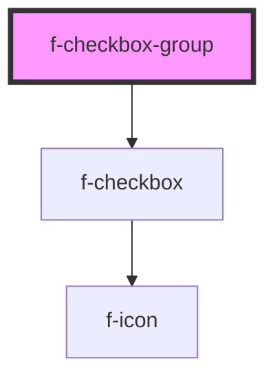

# f-checkbox-group

An input that when in a group allows the user to select multiple values from a list of options

<!-- Auto Generated Below -->

## Properties

| Property            | Attribute             | Description                             | Type                                                                                                                         | Default        |
| ------------------- | --------------------- | --------------------------------------- | ---------------------------------------------------------------------------------------------------------------------------- | -------------- |
| `allowMultiple`     | `allow-multiple`      | allow multiple checkboxes to be checked | `boolean`                                                                                                                    | `false`        |
| `checkboxGroupName` | `checkbox-group-name` | name of checkbox group                  | `string`                                                                                                                     | `undefined`    |
| `checkboxItems`     | --                    | array of checkbox props                 | `{ checkboxName?: string; uuid: string; checked?: boolean; disabled?: boolean; labelText: string; initialValue: string; }[]` | `undefined`    |
| `variant`           | `variant`             | orientation of checkbox group buttons   | `"horizontal" \| "vertical"`                                                                                                 | `'horizontal'` |

## Dependencies

### Depends on

- [f-checkbox](../f-checkbox)

### Graph

----------------------------------------------

*Built with [StencilJS](https://stenciljs.com/)*
