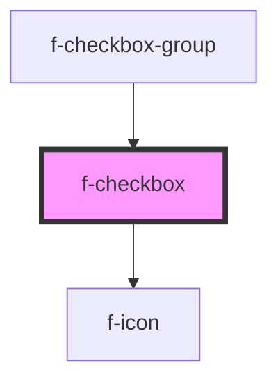

# f-checkbox

An input for choosing from predefined options:

when used alone, it gives a binary choice (checked/unchecked);
in a group it allows the user to select multiple values from a list of options.

<!-- Auto Generated Below -->

## Properties

| Property       | Attribute       | Description                           | Type      | Default     |
| -------------- | --------------- | ------------------------------------- | --------- | ----------- |
| `checkboxName` | `checkbox-name` |                                       | `string`  | `undefined` |
| `checked`      | `checked`       | is checkbox checked                   | `boolean` | `false`     |
| `disabled`     | `disabled`      | is checkbox disabled                  | `boolean` | `false`     |
| `errorMessage` | `error-message` | error message for checkbox (optional) | `string`  | `undefined` |
| `initialValue` | `initial-value` | initial value of checkbox             | `string`  | `undefined` |
| `labelText`    | `label-text`    | label of checkbox                     | `string`  | `undefined` |
| `uuid`         | `uuid`          | uuid for checkbox                     | `string`  | `undefined` |

## Events

| Event             | Description                         | Type               |
| ----------------- | ----------------------------------- | ------------------ |
| `checkboxChecked` | emits checkbox detail when selected | `CustomEvent<any>` |

## Dependencies

### Used by

 - [f-checkbox-group](../f-checkbox-group)

### Depends on

- [f-icon](../f-icon)

### Graph

----------------------------------------------

*Built with [StencilJS](https://stenciljs.com/)*
