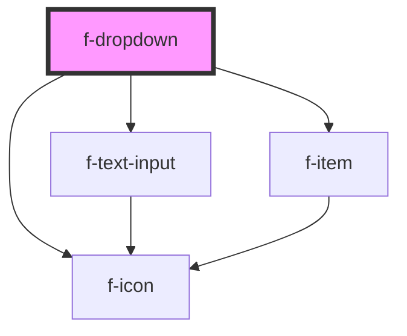

# f-dropdown

A menu in which options are hidden by default but can be shown by interacting with a button; it differs from a select in that it shows actions or navigation options and is not a form input.

<!-- Auto Generated Below -->

## Properties

| Property        | Attribute        | Description                                                       | Type                   | Default     |
| --------------- | ---------------- | ----------------------------------------------------------------- | ---------------------- | ----------- |
| `disabled`      | `disabled`       | set the dropdown to disabled                                      | `boolean`              | `false`     |
| `errorMessage`  | `error-message`  | error message for textarea (optional)                             | `string`               | `undefined` |
| `inputId`       | `input-id`       | uuid for input                                                    | `string`               | `undefined` |
| `items`         | --               | array of IItemModels                                              | `IItemModel[]`         | `undefined` |
| `labelText`     | `label-text`     | label text for the f-text-input component                         | `string`               | `undefined` |
| `listDirection` | `list-direction` | direction in which the dropdown list is displayed, up or down     | `"down" \| "up"`       | `'down'`    |
| `listSize`      | `list-size`      | the number of items to show in the dropdown list                  | `number`               | `7`         |
| `multiple`      | `multiple`       | sets the selection to multi-select                                | `boolean`              | `false`     |
| `placeholder`   | `placeholder`    | place holder text to display when no dropdown selections are made | `string`               | `undefined` |
| `size`          | `size`           | size of the input items in the list options are default or small  | `"default" \| "small"` | `'default'` |
| `toggleId`      | `toggle-id`      | uuid for toggle button                                            | `string`               | `undefined` |

## Events

| Event                  | Description                                  | Type               |
| ---------------------- | -------------------------------------------- | ------------------ |
| `dropdownItemSelected` | emits the selected item from the items array | `CustomEvent<any>` |

## CSS Custom Properties

| Name                         | Description                        |
| ---------------------------- | ---------------------------------- |
| `--f-dropdown-display`       | display type of dropdown           |
| `--f-dropdown-options-width` | width of the dropdown options list |
| `--f-dropdown-width`         | width of the dropdown              |

## Dependencies

### Depends on

- [f-text-input](../f-text-input)
- [f-icon](../f-icon)
- [f-item](../f-item)

### Graph

----------------------------------------------

*Built with [StencilJS](https://stenciljs.com/)*
