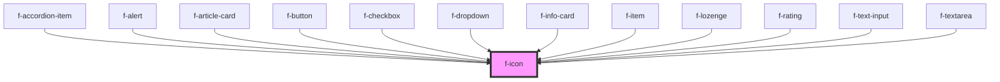

# f-icon

An icon is a graphic symbol designed to visually indicate the purpose of an interface element.

<!-- Auto Generated Below -->

## Properties

| Property     | Attribute | Description               | Type          | Default     |
| ------------ | --------- | ------------------------- | ------------- | ----------- |
| `iconConfig` | --        | config for icon component | `IIconConfig` | `undefined` |

## CSS Custom Properties

| Name             | Description       |
| ---------------- | ----------------- |
| `--f-icon-color` | Color of the icon |
| `--f-icon-size`  | Size of the icon  |

## Dependencies

### Used by

 - [f-accordion-item](../f-accordion-item)
 - [f-alert](../f-alert)
 - [f-article-card](../f-article-card)
 - [f-button](../f-button)
 - [f-checkbox](../f-checkbox)
 - [f-dropdown](../f-dropdown)
 - [f-info-card](../f-info-card)
 - [f-item](../f-item)
 - [f-lozenge](../f-lozenge)
 - [f-rating](../f-rating)
 - [f-text-input](../f-text-input)
 - [f-textarea](../f-textarea)

### Graph

----------------------------------------------

*Built with [StencilJS](https://stenciljs.com/)*
