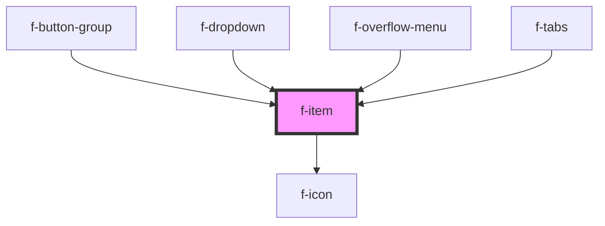

# f-item

<!-- Auto Generated Below -->

## Properties

| Property          | Attribute          | Description              | Type         | Default     |
| ----------------- | ------------------ | ------------------------ | ------------ | ----------- |
| `item`            | --                 | model for item           | `IItemModel` | `undefined` |
| `parentComponent` | `parent-component` | preant component of item | `string`     | `undefined` |

## Events

| Event                    | Description                             | Type               |
| ------------------------ | --------------------------------------- | ------------------ |
| `buttonGroupItemSelect`  | emits button group item being selected  | `CustomEvent<any>` |
| `dropdownItemSelect`     | emits dropdown item being selected      | `CustomEvent<any>` |
| `itemSelect`             | emits item being selected               | `CustomEvent<any>` |
| `overflowMenuItemSelect` | emits overflow menu item being selected | `CustomEvent<any>` |
| `tabItemSelect`          | emits tab item being selected           | `CustomEvent<any>` |

## Dependencies

### Used by

 - [f-button-group](../f-button-group)
 - [f-dropdown](../f-dropdown)
 - [f-overflow-menu](../f-overflow-menu)
 - [f-tabs](../f-tabs)

### Depends on

- [f-icon](../f-icon)

### Graph

----------------------------------------------

*Built with [StencilJS](https://stenciljs.com/)*
