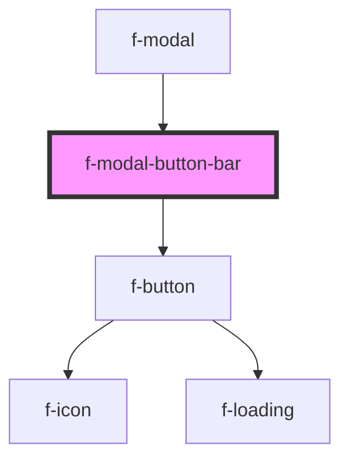

# f-modal-button-bar

<!-- Auto Generated Below -->

## Properties

| Property       | Attribute | Description | Type                  | Default |
| -------------- | --------- | ----------- | --------------------- | ------- |
| `modalButtons` | --        |             | `IFButtonInterface[]` | `[]`    |

## Dependencies

### Used by

 - [f-modal](../f-modal)

### Depends on

- [f-button](../f-button)

### Graph

----------------------------------------------

*Built with [StencilJS](https://stenciljs.com/)*
