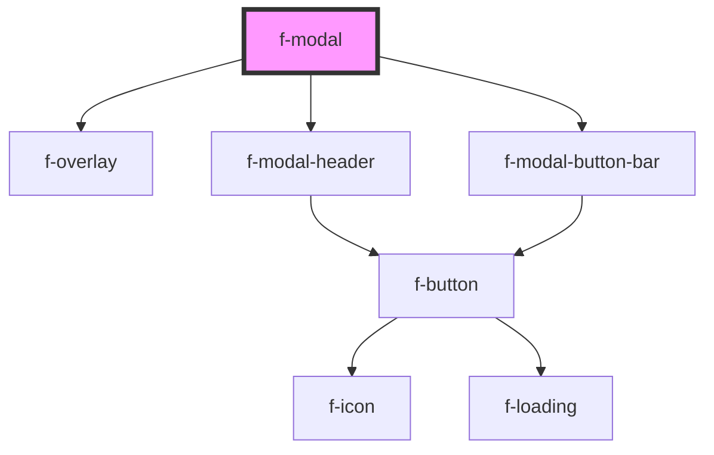

# f-modal

A modal is an interface element that appears over other content. It requires an interaction from the user before they can return to whatever is underneath.

<!-- Auto Generated Below -->

## Properties

| Property     | Attribute     | Description                             | Type                                                                                                                 | Default     |
| ------------ | ------------- | --------------------------------------- | -------------------------------------------------------------------------------------------------------------------- | ----------- |
| `buttons`    | --            | button array for modal button bar       | `IFButtonInterface[]`                                                                                                | `[]`        |
| `closeText`  | `close-text`  | close text for close button             | `string`                                                                                                             | `undefined` |
| `hasClose`   | `has-close`   | is there a close button (default: true) | `boolean`                                                                                                            | `true`      |
| `headerText` | `header-text` | header text for modal                   | `string`                                                                                                             | `undefined` |
| `position`   | `position`    | position of modal (default: center)     | `"bottom" \| "bottom-left" \| "bottom-right" \| "center" \| "left" \| "right" \| "top" \| "top-left" \| "top-right"` | `'center'`  |
| `size`       | `size`        |                                         | `"custom" \| "large" \| "medium" \| "small"`                                                                         | `'custom'`  |
| `variant`    | `variant`     | variant for modal (default: dialog)     | `"dialog" \| "drawer"`                                                                                               | `'dialog'`  |
| `visible`    | `visible`     | is modal visible                        | `boolean`                                                                                                            | `false`     |

## CSS Custom Properties

| Name                        | Description                                            |
| --------------------------- | ------------------------------------------------------ |
| `--f-modal-content-padding` | padding of content inside modal                        |
| `--f-modal-custom-width`    | width of modal                                         |
| `--f-modal-margin`          | margin around modal when positioned at edges of screen |

## Dependencies

### Depends on

- [f-overlay](../f-overlay)
- [f-modal-header](../f-modal-header)
- [f-modal-button-bar](../f-modal-button-bar)

### Graph

----------------------------------------------

*Built with [StencilJS](https://stenciljs.com/)*
