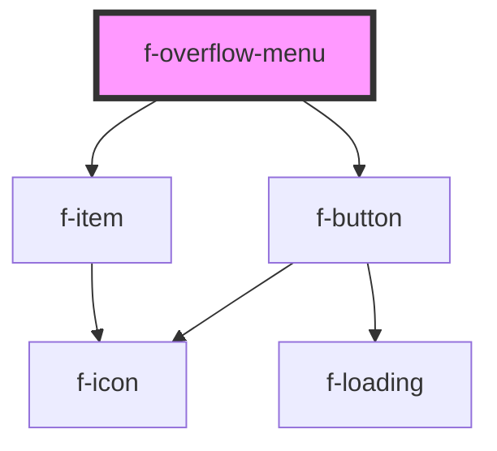

# f-overflow-menu

<!-- Auto Generated Below -->

## Properties

| Property             | Attribute       | Description                        | Type                        | Default     |
| -------------------- | --------------- | ---------------------------------- | --------------------------- | ----------- |
| `inContainer`        | `in-container`  | is overflow menu in a container    | `boolean`                   | `false`     |
| `isIconOnly`         | `is-icon-only`  | is overflow menu icon only?        | `boolean`                   | `false`     |
| `overflowIconConfig` | --              | iconConfig for overflow menu       | `IIconConfig`               | `undefined` |
| `overflowItems`      | --              | Items for overflow menu            | `INavigationItemModel[]`    | `undefined` |
| `overflowText`       | `overflow-text` | text for overflow menu             | `string`                    | `undefined` |
| `variant`            | `variant`       | type of button for overflow button | `"action" \| "progressive"` | `'action'`  |

## Events

| Event                  | Description                                 | Type               |
| ---------------------- | ------------------------------------------- | ------------------ |
| `overflowItemSelected` | emits detail of overflow menu item selected | `CustomEvent<any>` |

## Dependencies

### Depends on

- [f-button](../f-button)
- [f-item](../f-item)

### Graph

----------------------------------------------

*Built with [StencilJS](https://stenciljs.com/)*
