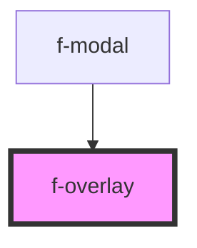

# f-overlay

<!-- Auto Generated Below -->

## Properties

| Property         | Attribute         | Description | Type      | Default |
| ---------------- | ----------------- | ----------- | --------- | ------- |
| `blockScrolling` | `block-scrolling` |             | `boolean` | `true`  |
| `escToClose`     | `esc-to-close`    |             | `boolean` | `true`  |
| `visible`        | `visible`         |             | `boolean` | `false` |

## Dependencies

### Used by

 - [f-modal](../f-modal)

### Graph

----------------------------------------------

*Built with [StencilJS](https://stenciljs.com/)*
