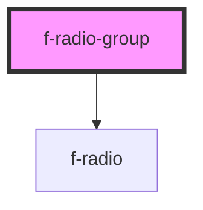

# f-radio-group

Group of radio buttons allow a user to select a single option from a list of predefined options.

<!-- Auto Generated Below -->

## Properties

| Property         | Attribute          | Description                        | Type                                                                                                                       | Default        |
| ---------------- | ------------------ | ---------------------------------- | -------------------------------------------------------------------------------------------------------------------------- | -------------- |
| `radioGroupName` | `radio-group-name` | name of radio group                | `string`                                                                                                                   | `undefined`    |
| `radioItems`     | --                 | array of radio props               | `{ radioName?: string; uuid: string; selected?: boolean; disabled?: boolean; labelText: string; initialValue: string; }[]` | `undefined`    |
| `variant`        | `variant`          | orientation of radio group buttons | `"horizontal" \| "vertical"`                                                                                               | `'horizontal'` |

## Dependencies

### Depends on

- [f-radio](../f-radio)

### Graph

----------------------------------------------

*Built with [StencilJS](https://stenciljs.com/)*
