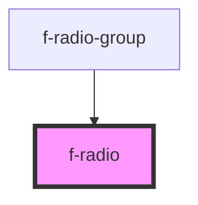

# f-radio

Radio buttons allow a user to select a single option from a list of predefined options.

<!-- Auto Generated Below -->

## Properties

| Property       | Attribute       | Description            | Type      | Default     |
| -------------- | --------------- | ---------------------- | --------- | ----------- |
| `disabled`     | `disabled`      | is radio disabled      | `boolean` | `false`     |
| `initialValue` | `initial-value` | initial value of radio | `string`  | `undefined` |
| `labelText`    | `label-text`    | label of radio         | `string`  | `undefined` |
| `radioName`    | `radio-name`    |                        | `string`  | `undefined` |
| `selected`     | `selected`      | is radio selected      | `boolean` | `false`     |
| `uuid`         | `uuid`          | uuid for radio         | `string`  | `undefined` |

## Events

| Event           | Description                      | Type               |
| --------------- | -------------------------------- | ------------------ |
| `radioSelected` | emits radio detail when selected | `CustomEvent<any>` |

## Dependencies

### Used by

 - [f-radio-group](../f-radio-group)

### Graph

----------------------------------------------

*Built with [StencilJS](https://stenciljs.com/)*
