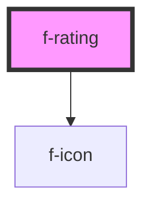

# f-rating

Ratings let users see and/or set a star rating for a product or other item.

<!-- Auto Generated Below -->

## Properties

| Property | Attribute | Description                         | Type     | Default     |
| -------- | --------- | ----------------------------------- | -------- | ----------- |
| `rating` | `rating`  | number of rating items to be filled | `number` | `undefined` |

## Dependencies

### Depends on

- [f-icon](../f-icon)

### Graph

----------------------------------------------

*Built with [StencilJS](https://stenciljs.com/)*
