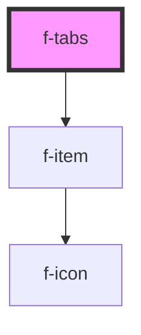

# f-tabs

Tabbed interfaces are a way of navigating between multiple panels, reducing clutter and fitting more into a smaller space.

<!-- Auto Generated Below -->

## Properties

| Property  | Attribute | Description         | Type                         | Default        |
| --------- | --------- | ------------------- | ---------------------------- | -------------- |
| `items`   | --        | array of itemModels | `IItemModel[]`               | `undefined`    |
| `variant` | `variant` | variant of tabs     | `"horizontal" \| "vertical"` | `'horizontal'` |

## Events

| Event             | Description                   | Type               |
| ----------------- | ----------------------------- | ------------------ |
| `tabItemSelected` | emits tab item being selected | `CustomEvent<any>` |

## CSS Custom Properties

| Name                | Description                                      |
| ------------------- | ------------------------------------------------ |
| `--f-tab-min-width` | minimum width for each tab item (default: 200px) |

## Dependencies

### Depends on

- [f-item](../f-item)

### Graph

----------------------------------------------

*Built with [StencilJS](https://stenciljs.com/)*
