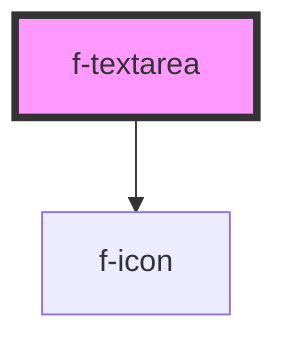

# f-textarea

A form control for editing multi-line text.

<!-- Auto Generated Below -->

## Properties

| Property       | Attribute       | Description                           | Type      | Default     |
| -------------- | --------------- | ------------------------------------- | --------- | ----------- |
| `disabled`     | `disabled`      | is textarea disabled (optional)       | `boolean` | `false`     |
| `errorMessage` | `error-message` | error message for textarea (optional) | `string`  | `undefined` |
| `helperText`   | `helper-text`   | helper text for textarea (optional)   | `string`  | `undefined` |
| `initialValue` | `initial-value` | initial value of textarea (optional)  | `string`  | `undefined` |
| `labelText`    | `label-text`    | label/placeholder text for textarea   | `string`  | `undefined` |
| `required`     | `required`      | required state of textarea            | `boolean` | `false`     |
| `uuid`         | `uuid`          | uuid for textarea                     | `string`  | `undefined` |

## Events

| Event             | Description | Type               |
| ----------------- | ----------- | ------------------ |
| `textareaBlur`    |             | `CustomEvent<any>` |
| `textareaChanged` |             | `CustomEvent<any>` |
| `textareaFocused` |             | `CustomEvent<any>` |

## CSS Custom Properties

| Name                      | Description            |
| ------------------------- | ---------------------- |
| `--f-textarea-min-height` | min-height of textarea |
| `--f-textarea-min-width`  | min-width of textarea  |

## Dependencies

### Depends on

- [f-icon](../f-icon)

### Graph

----------------------------------------------

*Built with [StencilJS](https://stenciljs.com/)*
