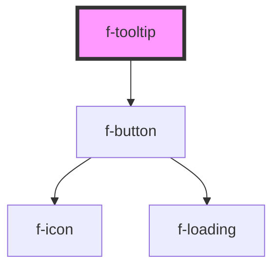

# f-tooltip

A means of displaying a description or extra information about an element, usually on hover, but can also be on click or tap.

<!-- Auto Generated Below -->

## Properties

| Property     | Attribute      | Description                                  | Type                                     | Default     |
| ------------ | -------------- | -------------------------------------------- | ---------------------------------------- | ----------- |
| `content`    | `content`      | content of tooltip                           | `string`                                 | `undefined` |
| `isIconOnly` | `is-icon-only` | is the tooltip just an icon (default: true)  | `boolean`                                | `true`      |
| `position`   | `position`     | position of tooltip content (default: right) | `"bottom" \| "left" \| "right" \| "top"` | `'right'`   |
| `variant`    | `variant`      | variant of tooltip trigger (default: info)   | `"info" \| "question"`                   | `'info'`    |

## Dependencies

### Depends on

- [f-button](../f-button)

### Graph

----------------------------------------------

*Built with [StencilJS](https://stenciljs.com/)*
